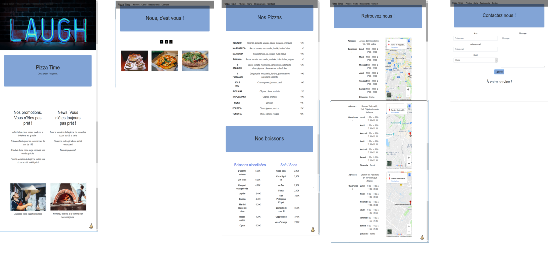
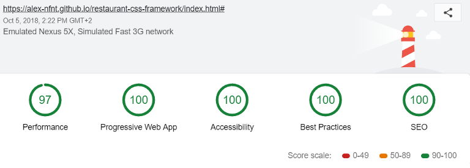
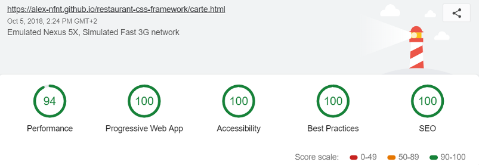
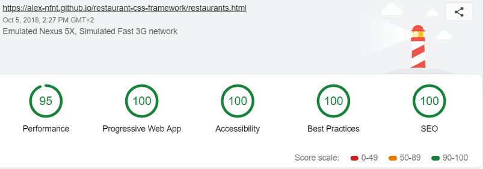
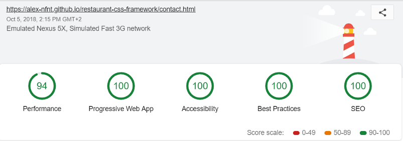

# restaurant-css-framework

## Mais qui a fait ce projet ? 
Et bien c'est moi même avec mes petites mimines

## Mais Qu’est-ce que c’est que ça ?
C'est le site d'un faux restaurant, je me suis imaginé une pizzeria modeste qui possède un site internet. C'est pour ça que le design est assez simple, je visais pas la simulation d'un site de restaurant 3 étoiles.

## Mais t'as bossé quand là dessus ? 
J'ai bossé sur ce projet à 3 reprises. Une fois début juillet  (je devais avoir 2 mois de code dans les papattes), ensuite je l'ai repris un peu fin août. Et je l'ai fini début octobre, et mon Dieu que je trouvais le code moche ! Mais bon j'ai su corriger le tir as we say.

## Mais t'étais où quand t'as fait ça ?
J'étais en formation chez BeCode ! On avait un projet avec des consignes que tu peux retrouver là :https://github.com/becodeorg/Johnson2/tree/master/projets/Restaurant_Bootstrap. J'ai juste pas utilisé les  car j'étais/je suis pas fan.

## Mais à quoi ressemble ton site ? 
De base je t'invite à cliquer sur ce lien https://alex-nfnt.github.io/restaurant-css-framework/index.html. Mais si t'as pas envie tu peux quand même jeté un œil à ce screenshot : 

## La progression… C’est fini ? 
Et oui ! Je pense que je vais m'arrêter là, peut être que je rajouterai une chose où l'autre, mais il n'y aura plus de gros changements.

## Et qu’est-ce que ça contient ? 
Ça contient du HTML, du CSS (avec Bootstrap) et un peu de Javascript.

## Comment qu’on l’installe ? 
Si vraiment t'as envie d'y toucher : git clone https://github.com/Alex-Nfnt/restaurant-css-framework.git et c'est à toi de jouer ! 

## Au fait ... Le lighthouse ça donne quoi ?
Et ben il est pas mal ! 

#### Page index : 

#### Page photos : 

#### Page carte :

#### Page restaurants :

#### Page contact

## Crédits 

### Photos 

### Code

